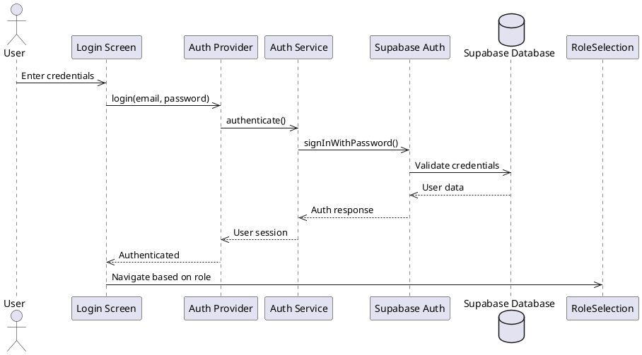
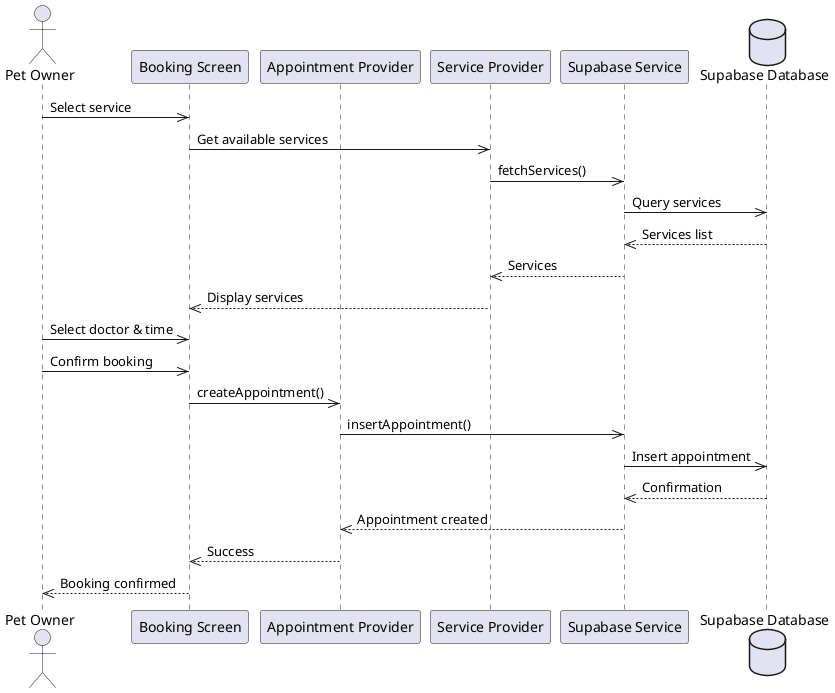

# Vet Care Clinic App - Component Diagram

## PlantUML Component Diagram

```plantuml
@startuml VetCare_Component_Diagram
!theme plain
skinparam componentStyle rectangle
skinparam linetype ortho
skinparam packageStyle rectangle

package "Frontend - Flutter App" {
    [Main Application] as Main
    
    package "UI Layer - Screens" {
        [Login Screen]
        [Register Screen]
        [Email Verification]
        [Role Selection]
        
        [Admin Dashboard]
        [Doctor Dashboard]
        [Driver Dashboard]
        [Pet Owner Dashboard]
        
        [Appointment Management]
        [Medical Records]
        [Schedule Settings]
        [Document Upload]
        [Profile Doctor]
        [Emergency Cases]
        [Inventory Management]
        
        [Booking Screen]
        [Pet Management]
        [Payment Processing]
        [Doctor Selection - Owner]
        [Driver Tracking]
        [Medical History]
        
        [Doctor Selection - Driver]
        [Van Selection - Driver]
        [Driver Emergency]
        [Driver Profile]
        
        [User Management]
        [Service Management]
        [Area Management]
        [Audit Logs]
        [Reporting]
        [System Settings]
        
        [Notification Preferences]
        [Language Toggle]
    }
    
    package "Reusable Components" {
        [UI Kit Components]
        [Modern Cards]
        [Advanced UI Components]
    }
}

package "State Management - Providers" {
    [Auth Provider]
    [Appointment Provider]
    [Pet Provider]
    [Payment Provider]
    [Medical Provider]
    [Schedule Provider]
    [Notification Provider]
    [Theme Provider]
    [Locale Provider]
    [Admin Provider]
    [Driver Verification Provider]
    [Inventory Provider]
    [Service Provider]
    [Page Provider]
    [Van Provider]
}

package "Services Layer" {
    [Auth Service]
    [Supabase Service]
    [Supabase Complete Service]
    [Notification Service]
    [Location Service]
    [Calendar Service]
    [PDF Service]
    [Email Service]
    [Qdrant Service]
    [App Close Service]
}

package "Data Models" {
    [User Model]
    [Pet Model]
    [Appointment Model]
    [Payment Model]
    [Medical Record]
    [Service Model]
    [Schedule Model]
    [Notification Model]
    [Document Model]
    [Driver Verification]
    [Doctor Verification]
    [Inventory Item]
    [Van Model]
    [Location Data]
    [Page Model]
}

package "Theming" {
    [App Theme]
    [Vet Theme]
}

package "Utilities" {
    [Translations]
    [Localization Helper]
    [Password Utilities]
    [Dynamic Closure]
}

cloud "External Systems" {
    [Supabase Auth]
    [Supabase Database]
    [Firebase Cloud Messaging]
    [Location Services API]
    [PDF Generation API]
    [Email Service]
}

' Relationships
Main --> "UI Layer - Screens"
Main --> "State Management - Providers"
Main --> "Theming"

"UI Layer - Screens" --> "Reusable Components"
"UI Layer - Screens" --> "State Management - Providers"

"State Management - Providers" --> "Services Layer"
"State Management - Providers" --> "Data Models"

"Services Layer" --> "Data Models"
"Services Layer" --> "External Systems"

"Theming" --> "UI Layer - Screens"
"Utilities" --> "Reusable Components"
"Utilities" --> "Services Layer"

' Auth Flow
[Auth Provider] --> [Auth Service]
[Auth Service] --> [Supabase Auth]

' Notification Flow
[Notification Provider] --> [Notification Service]
[Notification Service] --> [Firebase Cloud Messaging]

' Location Flow
[Location Service] --> [Location Services API]

' Payment Flow
[Payment Provider] --> [Supabase Service]
[Supabase Service] --> [Supabase Database]

' Medical Flow
[Medical Provider] --> [PDF Service]
[PDF Service] --> [PDF Generation API]

' Admin Flows
[Admin Provider] --> [User Management]
[Admin Provider] --> [Service Management]
[Admin Provider] --> [Audit Logs]

' Doctor Flows
[Schedule Provider] --> [Schedule Settings]
[Document Provider] --> [Document Upload]

' Owner Flows
[Pet Provider] --> [Pet Management]
[Appointment Provider] --> [Booking]

' Driver Flows
[Driver Verification Provider] --> [Doctor Selection - Driver]
[Van Provider] --> [Van Selection - Driver]

' Translation Flow
[Locale Provider] --> [Translations]
[Translations] --> [Login Screen]
[Translations] --> [Admin Dashboard]
[Translations] --> [Doctor Dashboard]

@enduml
```

## PlantUML Sequence Diagram - Authentication Flow

## PlantUML Sequence Diagram - Booking Flow

## Component Summary

| Layer | Components | Purpose |
|-------|------------|---------|
| **UI Layer** | 30+ screens | User interface for all user roles |
| **State Management** | 15 providers | React-style state management |
| **Services** | 10 services | Business logic & API integration |
| **Models** | 16 models | Data structures |
| **External** | 6 systems | Supabase, FCM, Maps, PDF, Email |
